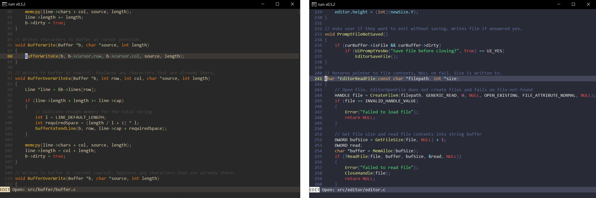
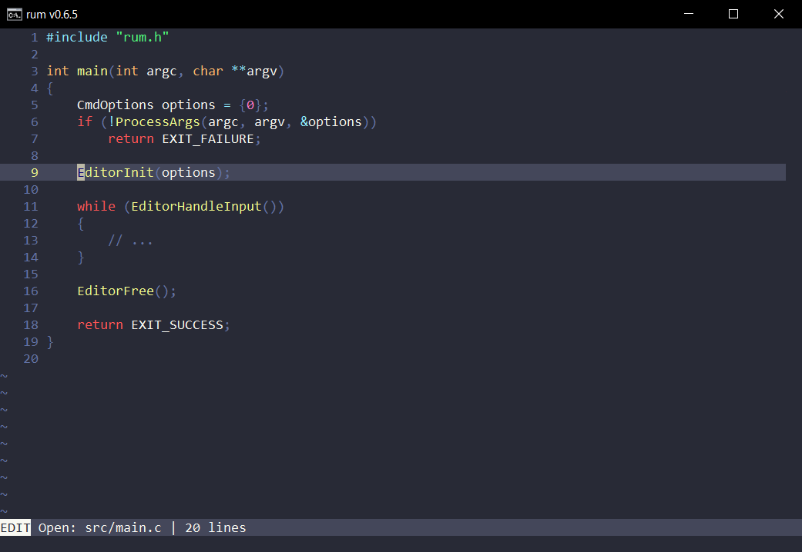
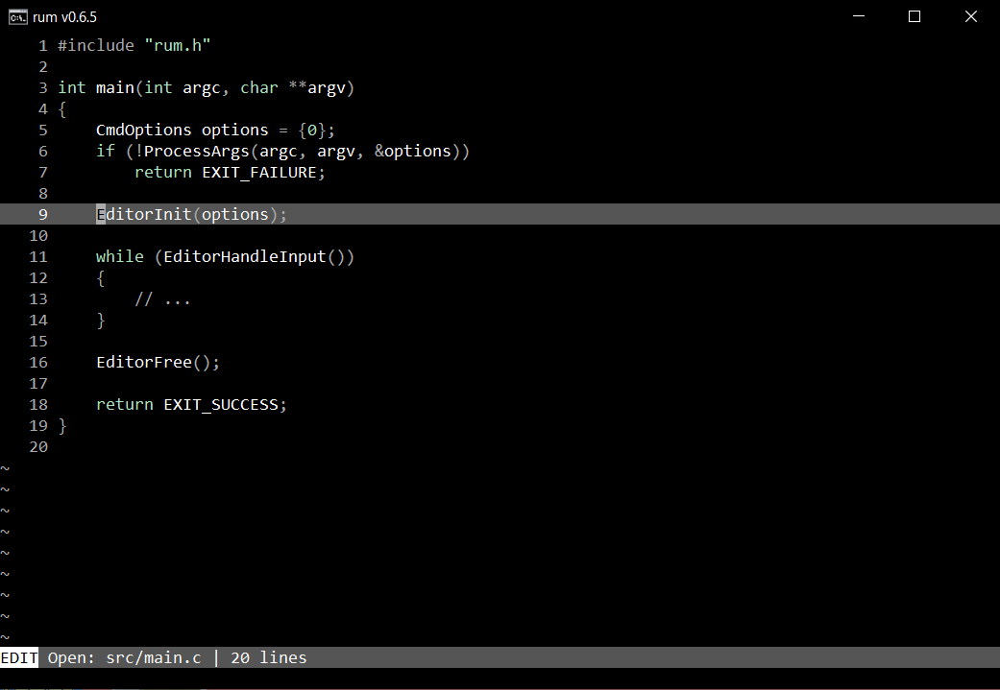
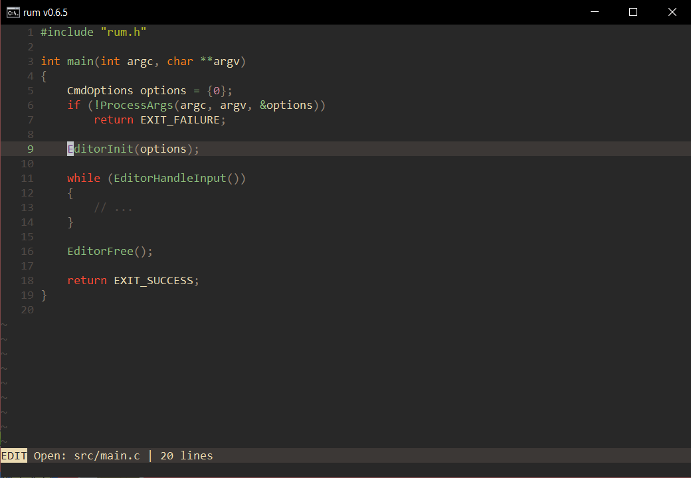

<br />
<div align="center">
  

  <p align="center">
    <b>Minimal editor for the Windows console</b>
    <br>
    <a href="https://github.com/jesperkha/rum/releases/tag/v0.7.0"><strong>Latest release »</strong></a>
    <br />
    <br />
  </p>
</div>

<div align="center">


<i>Rum editing its own source code</i>

<!-- <a href="https://github.com/jesperkha/rum/blob/main/.github/demo.gif">Demo gif</a> </i> -->

</div>

## About

Rum is a fast and minimal editor that supports syntax highlighting, search, split buffers, tabs and much more! It is specifically made for the windows terminal using the win32 console API. It has no other dependencies than libc and win32, making it very lightweight (~60kb) and easy to build! See [roadmap.md](roadmap.md) and [changelog.md](changelog.md) for progress on development.

## Installation

Download a [prebuilt binary](https://github.com/jesperkha/rum/releases)

or build from source (gcc required, no dependencies!)

```
git clone https://github.com/jesperkha/rum.git
cd rum
make release
```

**Note:** When moving the executable to another location, make sure you copy the `config` directory along with it.

<!-- ## Themes

<div align="center">



</div>

## Controls

Rum is modal editor like Vim and uses most of the same key controls for its 'edit' mode (vim normal mode). You can see a full list of keybinds by running the command `:help`. -->

<br>
<hr>

<div align="center">
  <h6>Jesper Hammer 2024</h6>
</div>
