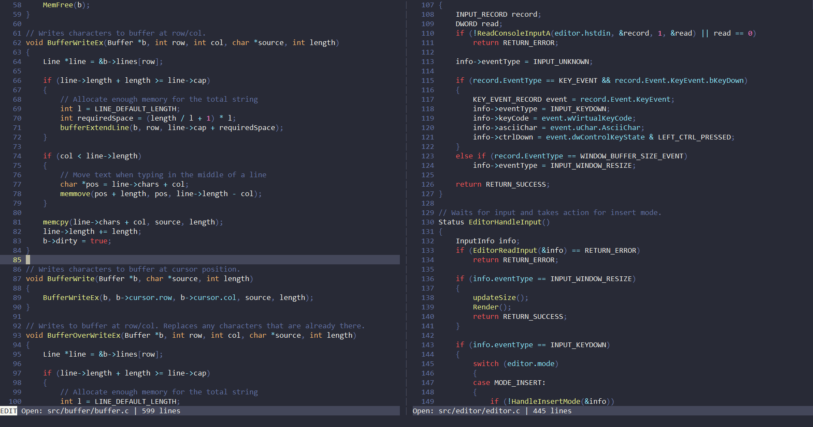

<br />
<div align="center">
  

  <p align="center">
    <b>Minimal editor for the Windows console</b>
    <br>
    <a href="https://github.com/jesperkha/rum/releases/tag/v0.6.0"><strong>Latest release »</strong></a>
    <br />
    <br />
  </p>
</div>

## About

Rum is a fast and minimal editor that supports syntax highlighting, typing features such as parenthesis matching and dynamic tabs, and config files for syntax and themes. It is specifically made for the windows terminal using the win32 console API. It has no other dependencies than libc and win32, making it very lightweight (~50kb) and easy to build! See [roadmap.md](roadmap.md) and [changelog.md](changelog.md) for progress on development.

## Installation

> Rum is Windows-only

Download a [prebuilt binary](https://github.com/jesperkha/rum/releases)

Or build from source (no dependencies needed!)

```
git clone https://github.com/jesperkha/rum.git
cd rum
make release
```

**Note:** When moving the executable to another location, make sure you copy the `config` directory along with it.

## Screenshots

<div align="center">


<a href="https://github.com/jesperkha/rum/blob/main/.github/demo.gif">Demo gif</a>

</div>

<br>
<hr>

<div align="center">
  <h6>Jesper Hammer 2024</h6>
</div>
